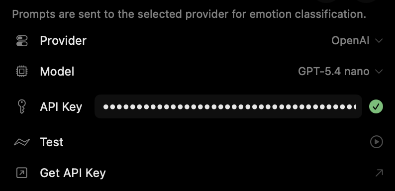
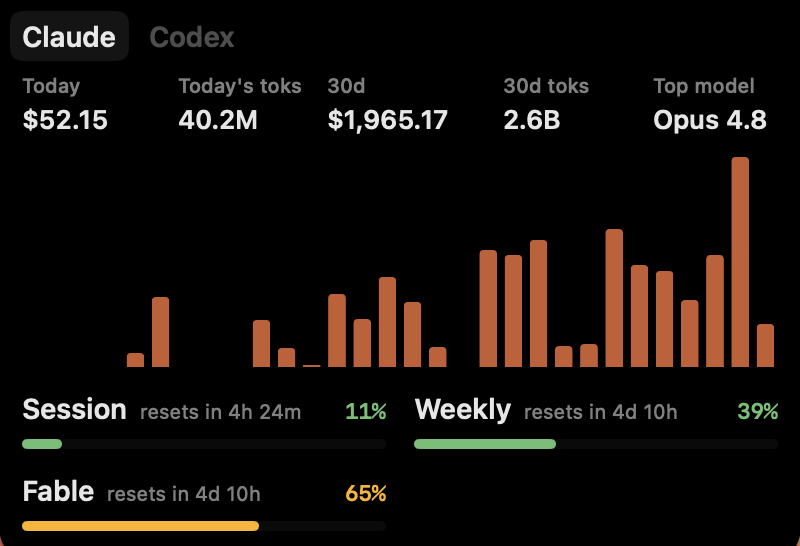

# Notchi

A macOS notch companion that reacts to Claude Code and Codex activity in real-time.

[][dmg]

https://github.com/user-attachments/assets/e417bd40-cae8-47c0-998a-905166cf3513

## What it does

- Reacts to Claude Code and Codex events in real-time (thinking, working, permission requests, compaction, errors, completions)
- Analyzes prompt sentiment via Anthropic or OpenAI APIs to show emotions (happy, elated, sad, neutral, sob)
- Click to expand and see session time and usage quota
- Supports multiple concurrent sessions, each with its own mascot from the Claude or Codex sprite family
- Sound effects for events with support for importable custom sounds (optional, auto-muted when terminal is focused)
- Available in English, Japanese, and Simplified / Traditional Chinese (follows your system language)
- Auto-updates via Sparkle

## Requirements

- macOS 15.0+ (Sequoia)
- MacBook with notch
- [Claude Code](https://docs.anthropic.com/en/docs/claude-code) and/or [Codex](https://openai.com/codex/) installed

## Install

1. [Download the latest DMG][dmg] (all versions are on the [releases page](https://github.com/sk-ruban/notchi/releases))
2. Open the DMG and drag Notchi to Applications
3. Launch Notchi — it auto-installs Claude Code and Codex hooks on first launch (whichever are present)
4. If you use Claude Code, a macOS keychain popup will appear asking to access its cached OAuth token (used for API usage stats). Click **Always Allow** so it won't prompt again on future launches

   

5. *(Optional)* Click the notch to expand → open Settings → paste your Anthropic or OpenAI API key. This enables sentiment analysis of your prompts so the mascot reacts emotionally

   

6. Start using Claude Code or Codex and watch Notchi react
7. Track usage by clicking on the usage bar

   

## How it works

```
Claude Code / Codex --> Hooks (shell scripts) --> Unix Socket --> Event Parser --> State Machine --> Animated Sprites
```

Notchi registers shell script hooks with Claude Code and Codex on launch. When either agent emits events (tool use, thinking, prompts, permission requests, compaction, session start/end), the hook script sends JSON payloads to a Unix socket. The app parses these events, runs them through a state machine that maps to sprite animations (idle, working, sleeping, compacting, waiting), and uses Anthropic or OpenAI to analyze user prompt sentiment for emotional reactions.

Each session gets its own sprite on the grass island, drawn from the Claude or Codex sprite family depending on which agent it came from. Clicking expands the notch panel to show a live activity feed, session info, and Claude/Codex usage stats.

## Contributing

If you have any bugs, ideas, or would like to contribute through pull requests, please check out [Contributing to Notchi](CONTRIBUTING.md).

## Community Ports

- [notchi-for-windows](https://github.com/AptatoX/notchi-for-windows) by [@AptatoX](https://github.com/AptatoX), a community-made Windows port of Notchi
- [pixel-companion](https://github.com/Emi-Dz/pixel-companion) by [@Emi-Dz](https://github.com/Emi-Dz), a community-made Windows desktop companion inspired by Notchi

## Credits

- [Claude Island](https://github.com/farouqaldori/claude-island) — design inspiration for the app
- [Readout](https://readout.org) — design inspiration for [notchi.app](https://notchi.app)
- [Aseprite](https://www.aseprite.org/) — sprite design

## License

GPL-3.0-only. See [LICENSE](LICENSE).

[dmg]: https://github.com/sk-ruban/notchi/releases/download/v1.2.1/Notchi-1.2.1.dmg
